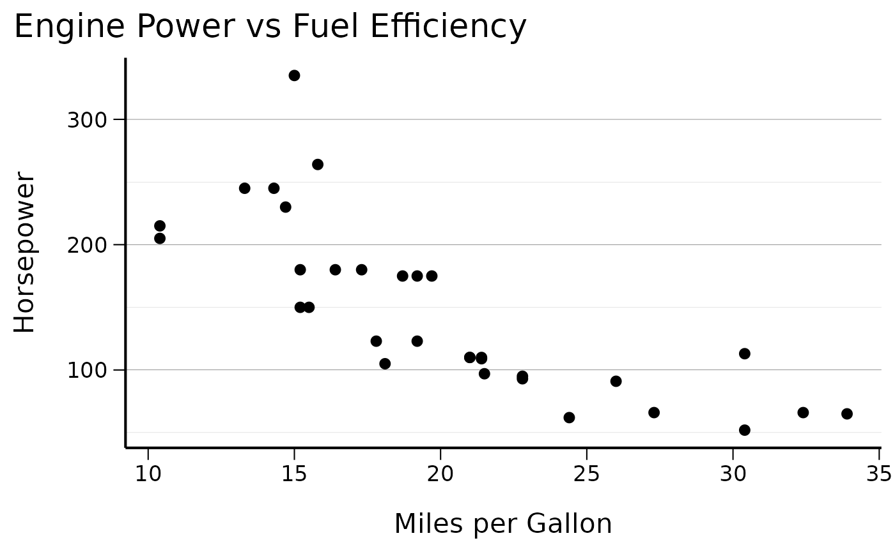
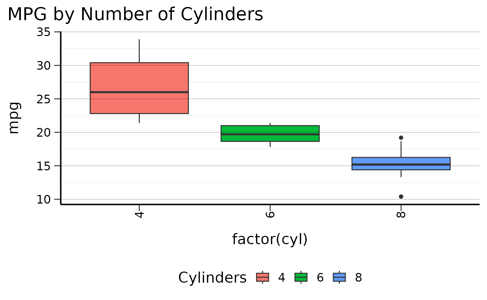
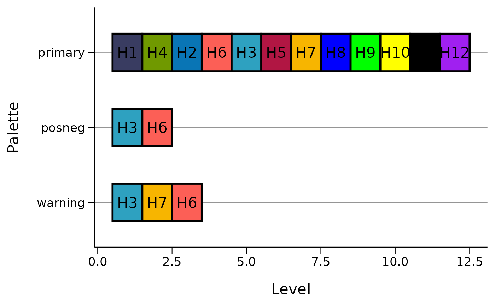
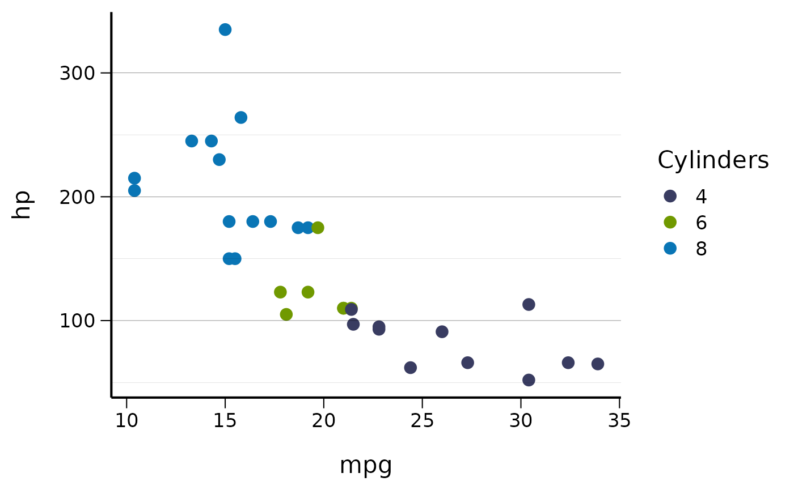
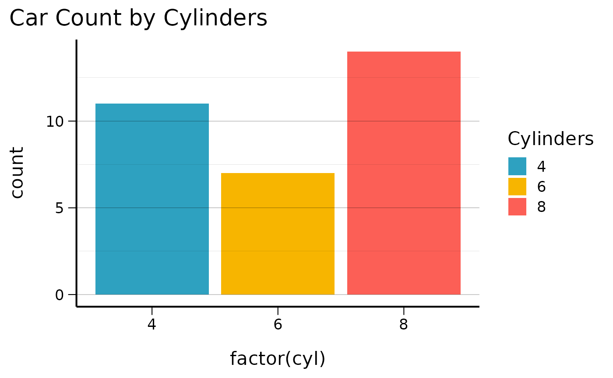
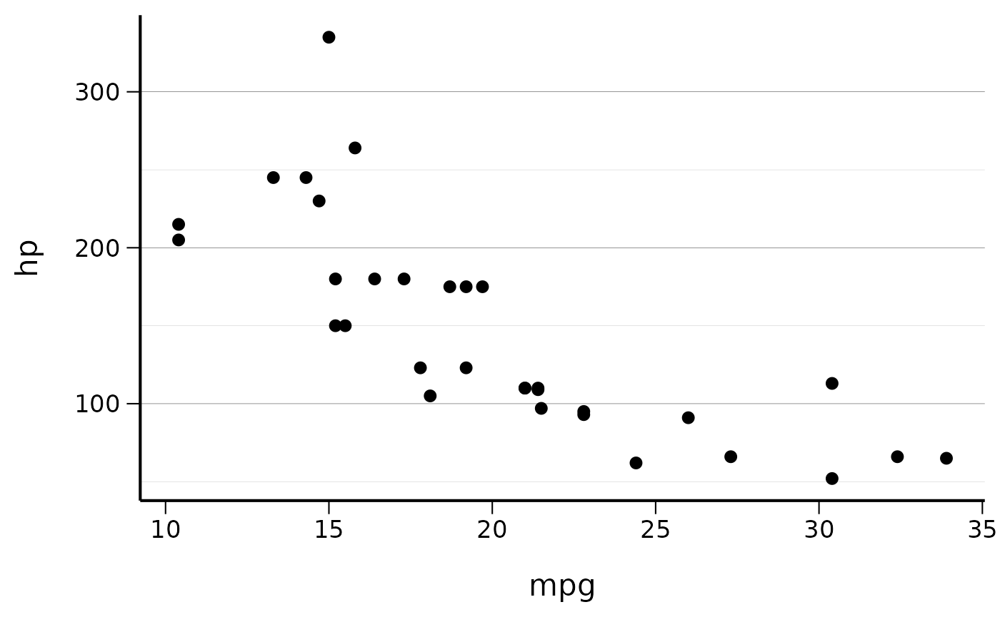
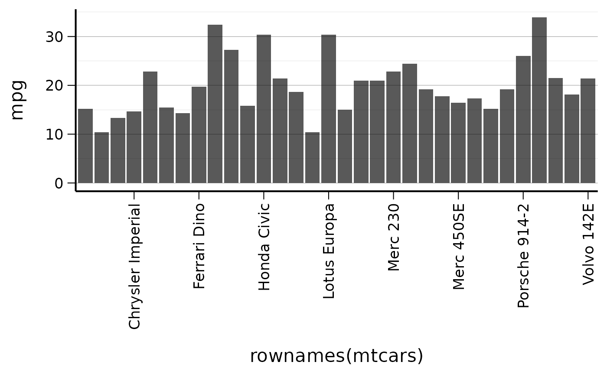

# Introduction to csstyle

``` r
library(csstyle)
#> csstyle 2025.8.21
#> https://niphr.github.io/csstyle/
library(ggplot2)
```

## Overview

The `csstyle` package provides a system for standardizing outputs such
as graphs, tables, and reports using CSIDS visual guidelines. Rather
than offering infinite customization options, `csstyle` focuses on
producing a limited set of outputs that consistently look the same.

## Key Features

- **Consistent ggplot2 themes** with CSIDS styling
- **Predefined color palettes** for professional visualizations  
- **Norwegian number formatting** conventions
- **Utility functions** for common tasks

## Using CSIDS Themes

The main theme function
[`theme_cs()`](https://niphr.github.io/csstyle/reference/theme.md)
provides a clean, professional appearance:

``` r
# Basic scatter plot with CSIDS theme
ggplot(mtcars, aes(x = mpg, y = hp)) +
  geom_point() +
  theme_cs() +
  labs(
    title = "Engine Power vs Fuel Efficiency",
    x = "Miles per Gallon",
    y = "Horsepower"
  )
```



You can customize the theme with various options:

``` r
# Theme with bottom legend and vertical x-axis labels
ggplot(mtcars, aes(x = factor(cyl), y = mpg, fill = factor(cyl))) +
  geom_boxplot() +
  theme_cs(legend_position = "bottom", x_axis_vertical = TRUE) +
  labs(title = "MPG by Number of Cylinders", fill = "Cylinders")
```



## Color Palettes

The package includes several predefined color palettes:

``` r
# View available colors
head(colors$named_colors)
#>        H1        H2        H3        H4        H5        H6 
#> "#393C61" "#0975B5" "#2EA1C0" "#709900" "#B11643" "#FC5F56"

# Display all palettes
display_all_palettes()
#> Warning: Using `size` aesthetic for lines was deprecated in ggplot2 3.4.0.
#> ℹ Please use `linewidth` instead.
#> ℹ The deprecated feature was likely used in the csstyle package.
#>   Please report the issue at <https://github.com/niphr/csstyle/issues>.
#> This warning is displayed once per session.
#> Call `lifecycle::last_lifecycle_warnings()` to see where this warning was
#> generated.
```



Use the color scales in your plots:

``` r
# Using the primary color palette
ggplot(mtcars, aes(x = mpg, y = hp, color = factor(cyl))) +
  geom_point(size = 3) +
  scale_color_cs(palette = "primary") +
  theme_cs() +
  labs(color = "Cylinders")
```



``` r
# Using the warning palette for fills
ggplot(mtcars, aes(x = factor(cyl), fill = factor(cyl))) +
  geom_bar() +
  scale_fill_cs(palette = "warning") +
  theme_cs() +
  labs(title = "Car Count by Cylinders", fill = "Cylinders")
```



## Number Formatting

The package provides Norwegian number formatting conventions:

``` r
# Format numbers with Norwegian conventions
numbers <- c(1234.56, 9876.54, 123.45, NA)

# Basic number formatting (0, 1, 2 decimal places)
format_num_as_nor_num_0(numbers)
#> [1] "1235" "9877" "123"  "IK"
format_num_as_nor_num_1(numbers)
#> [1] "1234,6" "9876,5" "123,5"  "IK"
format_num_as_nor_num_2(numbers)
#> [1] "1234,56" "9876,54" "123,45"  "IK"

# Percentage formatting
percentages <- c(12.34, 56.78, 90.12)
format_num_as_nor_perc_1(percentages)
#> [1] "12,3 %" "56,8 %" "90,1 %"

# Per 100k population rates
rates <- c(123.45, 678.90)
format_num_as_nor_per100k_1(rates)
#> [1] "123,5 /100k" "678,9 /100k"
```

## Date Formatting

Format dates using Norwegian conventions:

``` r
# Current date
format_date_as_nor()
#> [1] "30.06.2026"

# Specific dates
test_date <- as.Date("2023-12-25")
format_date_as_nor(test_date)
#> [1] "25.12.2023"

# Datetime formatting
test_datetime <- as.POSIXct("2023-12-25 14:30:00")
format_datetime_as_nor(test_datetime)
#> [1] "25.12.2023 kl. 14:00"

# Filename-safe datetime
format_datetime_as_file(test_datetime)
#> [1] "2023_12_25_143000"
```

## Journal Formatting

For academic publications, the package also provides journal formatting
functions that use international conventions (comma thousands separator,
decimal point, ISO 8601 dates):

### Number Formatting Comparison

``` r
# Compare Norwegian vs Journal formatting
numbers <- c(1234.56, 9876.54, NA)

# Norwegian format (space thousands, comma decimal, "IK" for NA)
format_num_as_nor_num_1(numbers)
#> [1] "1234,6" "9876,5" "IK"

# Journal format (comma thousands, decimal point, "NA" for NA)
format_num_as_journal_num_1(numbers)
#> [1] "1,234.6" "9,876.5" "NA"

# Percentage comparison
percentages <- c(12.34, 56.78)

# Norwegian: "12,3 %" vs Journal: "12.3%"
format_num_as_nor_perc_1(percentages)
#> [1] "12,3 %" "56,8 %"
format_num_as_journal_perc_1(percentages)
#> [1] "12.3%" "56.8%"

# Per 100k comparison  
rates <- c(123.45, 678.90)

# Norwegian: "123,5 /100k" vs Journal: "123.5/100k"
format_num_as_nor_per100k_1(rates)
#> [1] "123,5 /100k" "678,9 /100k"
format_num_as_journal_per100k_1(rates)
#> [1] "123.5/100k" "678.9/100k"
```

### Date Formatting Comparison

``` r
test_date <- as.Date("2023-12-25")
test_datetime <- as.POSIXct("2023-12-25 14:30:00")

# Norwegian format: "25.12.2023"
format_date_as_nor(test_date)
#> [1] "25.12.2023"

# Journal format (ISO 8601): "2023-12-25"
format_date_as_journal(test_date)
#> [1] "2023-12-25"

# Datetime comparison
format_datetime_as_nor(test_datetime)     # "25.12.2023 kl. 14:00"
#> [1] "25.12.2023 kl. 14:00"
format_datetime_as_journal(test_datetime)  # "2023-12-25 14:30:00"
#> [1] "2023-12-25 14:30:00"
```

### Log Scale Transformations

Both Norwegian and journal formats support inverse log transformations:

``` r
log_values <- c(1, 2, 3)

# Log2 transformations (2^1, 2^2, 2^3 = 2, 4, 8)
format_num_as_nor_invlog2_1(log_values)      # "2,0", "4,0", "8,0"
#> [1] "2,0" "4,0" "8,0"
format_num_as_journal_invlog2_1(log_values)  # "2.0", "4.0", "8.0"
#> [1] "2.0" "4.0" "8.0"

# Log10 transformations (10^1, 10^2, 10^3 = 10, 100, 1000)  
format_num_as_journal_invlog10_1(log_values) # "10.0", "100.0", "1,000.0"
#> [1] "10.0"    "100.0"   "1,000.0"
```

## Utility Functions

### Pretty Breaks

Use
[`pretty_breaks()`](https://niphr.github.io/csstyle/reference/pretty_breaks.md)
for nicely formatted axis breaks:

``` r
ggplot(mtcars, aes(x = mpg, y = hp)) +
  geom_point() +
  scale_y_continuous(breaks = pretty_breaks(n = 4)) +
  theme_cs()
```



### Every Nth

Display every nth label on crowded axes:

``` r
ggplot(mtcars, aes(x = rownames(mtcars), y = mpg)) +
  geom_col() +
  scale_x_discrete(breaks = every_nth(n = 4)) +
  theme_cs() +
  set_x_axis_vertical()
```



## Conclusion

The `csstyle` package provides a comprehensive set of tools for creating
consistent, professional visualizations that follow both Norwegian
(CSIDS) and international journal standards. The dual formatting
approach ensures that:

- **Norwegian functions** (`*_as_nor`) follow local conventions for
  domestic reports and presentations
- **Journal functions** (`*_as_journal`) follow international standards
  for academic publications

By providing both options while limiting excessive customization, the
package ensures consistent output formatting across different
publication contexts.

For more detailed examples and function documentation, use
[`help(package = "csstyle")`](https://niphr.github.io/csstyle/reference)
or refer to individual function help pages.
