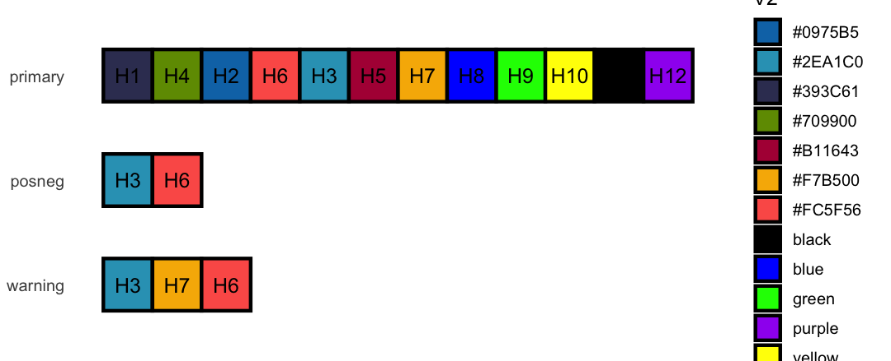

Highlights

01

### ggplot2 Themes

A Core Surveillance ggplot2 theme with configurable grid lines, legend
position, and axis orientation.

02

### Colour Palettes

Named colour scales (primary, warning, posneg) wired directly into
ggplot2 via
[`scale_color_cs()`](https://niphr.github.io/csstyle/reference/scale_color_cs.md)
and
[`scale_fill_cs()`](https://niphr.github.io/csstyle/reference/scale_fill_cs.md).

03

### Dual Formatting

Parallel number and date functions for Norwegian domestic reports and
international journal publications.

Palettes

The csstyle colour palettes

## Overview

csstyle provides ggplot2 themes, colour palettes, and formatting
functions that follow Core Surveillance visual guidelines. It covers
graphs, tables, and reports, keeping outputs consistent across projects.

Read the introduction vignette
[here](https://niphr.github.io/csstyle/articles/csstyle.md) or run
[`help(package = "csstyle")`](https://niphr.github.io/csstyle/reference).
